# EDA для линейной модели стоимости (Bishkek apartments)

Источник: `train_processed.csv` (7134 строки, 14 колонок). Целевая — `usd_price`. Все графики собраны скриптом `analyze.py` и лежат в `figs/`.

---

## 1. Распределения числовых признаков

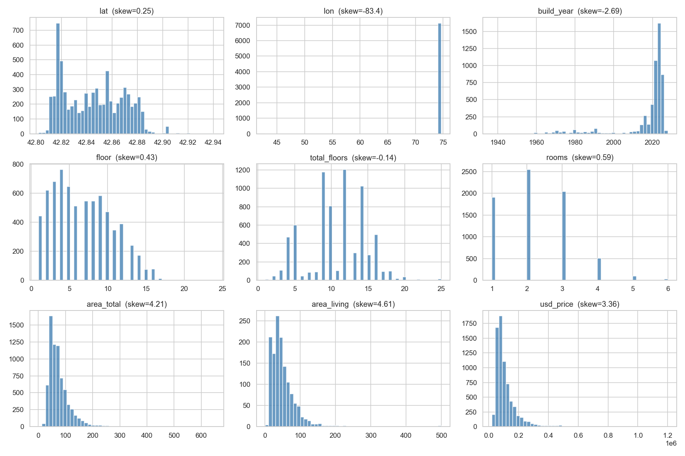

**Что видно.** `area_total`, `area_living`, `rooms`, `usd_price` — все скошены вправо (длинный хвост дорогих/больших объектов). `lat`/`lon` распределены узко (Бишкек), `build_year` бимодален — старый фонд (1960–1990) + современная застройка (2018–2025).

| Признак | Skew | Kurt | Пропусков |
|---|---:|---:|---:|
| lat | 0.25 | -0.92 | 0 |
| lon | -83.4 | 7011.53 | 0 |
| build_year | -2.69 | 6.44 | 1892 |
| floor | 0.43 | -0.6 | 18 |
| total_floors | -0.14 | -0.21 | 18 |
| rooms | 0.59 | 0.23 | 11 |
| area_total | 4.21 | 34.21 | 0 |
| area_living | 4.61 | 36.68 | 5749 |
| usd_price | 3.36 | 18.81 | 0 |

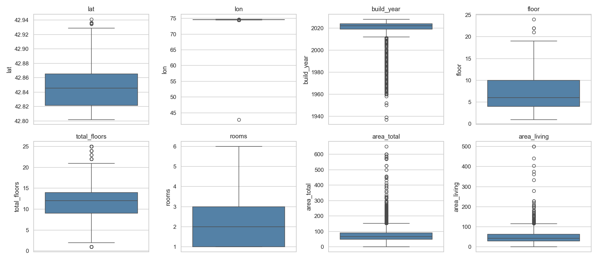

**Что видно.** Длинные верхние усы у `area_total` (до 650 м²) и `total_floors` (до 27) — это валидные элитки/новостройки. `area_living` имеет min=1 м² — явные ошибки разметки, фильтровать.

### Таргет: usd_price

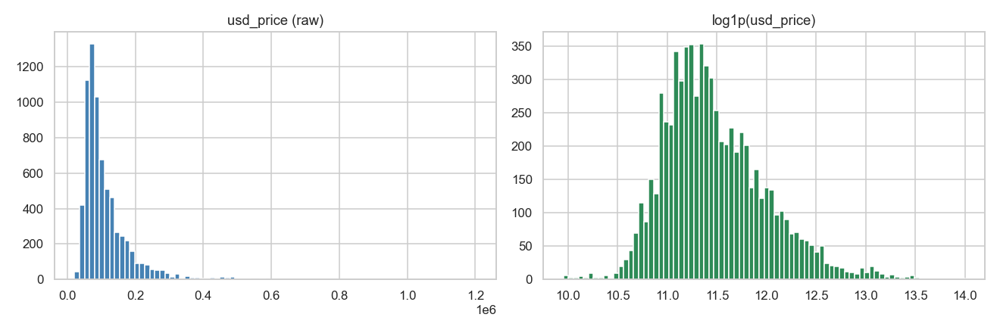

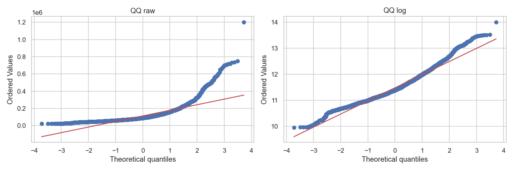

**Что видно.** Сырой `usd_price` сильно скошен (skew=3.36), QQ-линия резко уходит вверх в правом хвосте. После `log1p` распределение почти нормальное, QQ практически прямая в центральной части. **Решение:** обучать линейную модель на `y = log1p(usd_price)`, метрики типа RMSLE/MAE на лог-шкале.

---

## 2. Дисбаланс категориальных

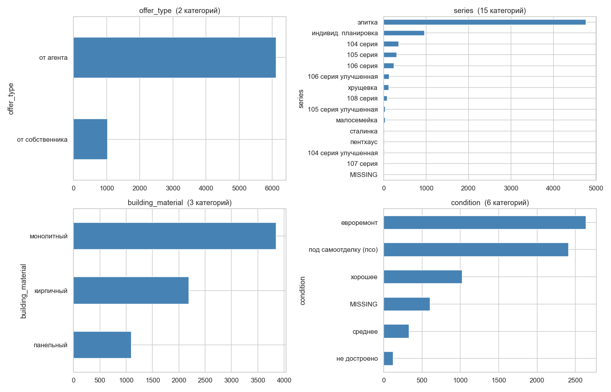

| Признак | Категорий | Top | Доля top | Min count | Пропусков, % |
|---|---:|---|---:|---:|---:|
| offer_type | 2 | от агента | 0.856 | 1024 | 0.0 |
| series | 15 | элитка | 0.669 | 1 | 0.0 |
| building_material | 3 | монолитный | 0.539 | 1096 | 0.0 |
| condition | 6 | евроремонт | 0.37 | 124 | 8.5 |

**Что видно.**
- `offer_type`: 86% «от агента» — сильный дисбаланс, но всего 2 класса, OHE безопасно.
- `series`: «элитка» доминирует (67%), 14 категорий, минимальная имеет всего 1 наблюдений. Редкие («107 серия», «104 серия улучшенная», «пентхаус») при OHE дадут шумные коэффициенты — **объединить классы с count < 30 в `series_other`**.
- `condition`: 8% пропусков — не дропать, а создать категорию `unknown`.
- `building_material`: 3 класса, баланс приемлемый.

---

## 3. Линейность связей с log(price)

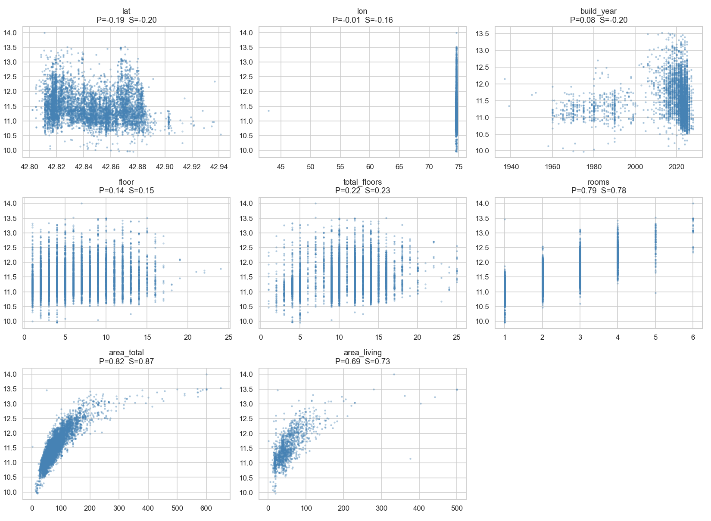

| Признак | Pearson | Spearman | |S|−|P| (изгиб) |
|---|---:|---:|---:|
| lat | -0.192 | -0.197 | 0.005 |
| lon | -0.007 | -0.165 | 0.158 |
| build_year | 0.081 | -0.199 | 0.117 |
| floor | 0.138 | 0.152 | 0.013 |
| total_floors | 0.22 | 0.232 | 0.012 |
| rooms | 0.786 | 0.781 | -0.006 |
| area_total | 0.818 | 0.874 | 0.056 |
| area_living | 0.691 | 0.733 | 0.043 |

**Что видно.** Чем больше gap между Spearman и Pearson, тем сильнее связь нелинейна. `area_total` (Pearson=0.818) — главный драйвер; gap у неё небольшой, но всё же отличный от нуля.

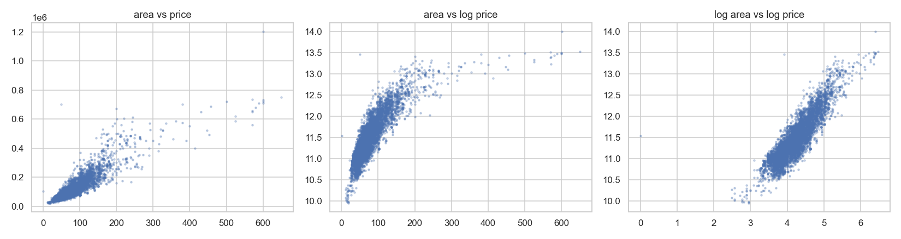

**Что видно.** Левый график — `area` vs `price` (изогнутая), средний — `area` vs `log(price)` (лучше, но нижний хвост загибается), правый — `log(area)` vs `log(price)` — **почти идеальная прямая**. Это классическая лог-лог-зависимость, типичная для рынка жилья. **Решение:** в линейку подаём `log(area_total)`, не сырую площадь.

---

## 4. Категории vs log(price) — ANOVA

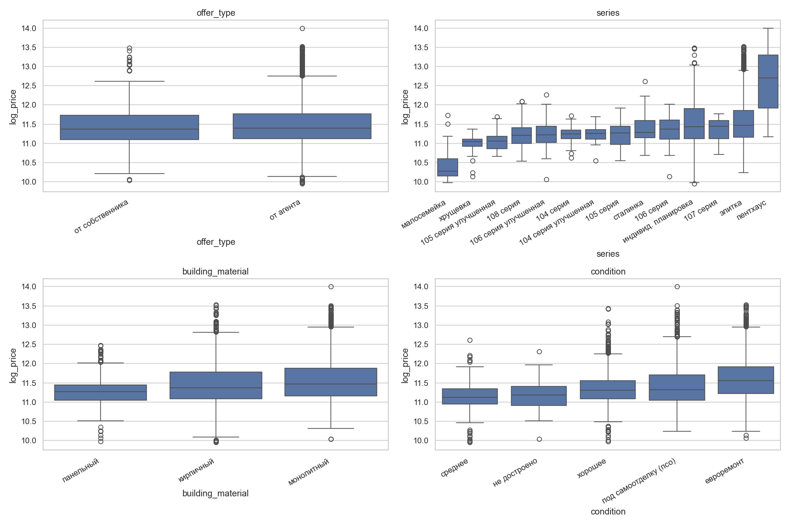

| Признак | F-statistic | p-value |
|---|---:|---:|
| offer_type | 7.9 | 5.03e-03 |
| series | 57.9 | 1.32e-144 |
| building_material | 124.6 | 6.36e-54 |
| condition | 136.8 | 1.95e-112 |

**Что видно.** Все категории значимы (p ≈ 0). Самый сильный сигнал у `series` (F=58) и `condition` (F=137). Боксплоты отсортированы по медиане — видно монотонную лестницу серий от «малосемейки» (дёшево) до «пентхауса» (дорого). Категории — обязательная часть линейной модели.

---

## 5. Распределение price_per_sqm по группам

Цена за квадрат — нормирует таргет относительно площади и показывает «качество» жилья, очищенное от размера. Для линейной модели это намёк на то, какие категории сдвигают **наклон** лог-лог-зависимости `log(price) ~ log(area)`.

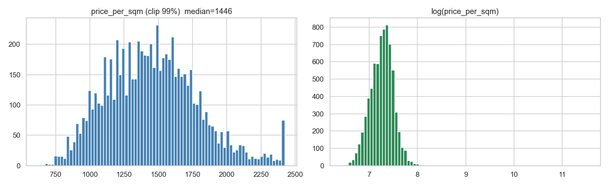

**Что видно.** Распределение скошено (есть выбросы > $5000/м², отдельные точки до $100k/м² — артефакты разметки). Лог-вид симметричен — то есть и `price_per_sqm` лучше лог-преобразовывать при анализе.

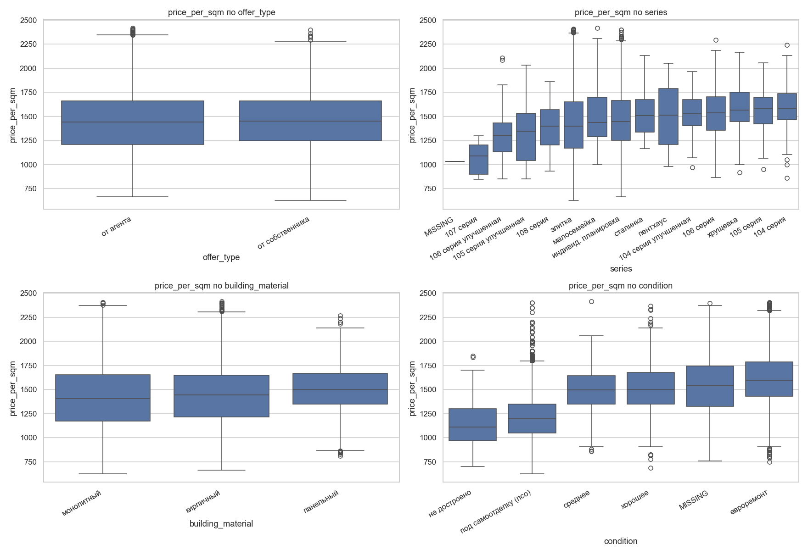

Сводка медиан (`$/м²`):

| Признак | Min медиана | Max медиана | Разброс | Самая дорогая категория | Самая дешёвая |
|---|---:|---:|---:|---|---|
| offer_type | 1440 | 1450 | 10 | от собственника | от агента |
| series | 1033 | 1585 | 551 | 104 серия | MISSING |
| building_material | 1407 | 1500 | 93 | панельный | монолитный |
| condition | 1111 | 1596 | 485 | евроремонт | не достроено |

**Выводы по группам:**
- `series`: разброс медиан $551/м² между «MISSING» и «104 серия». Самый сильный категориальный регрессор по удельной цене.
- `condition`: разброс $485/м². «Евроремонт» доминирует, «не достроено» — внизу. Линейная зависимость от качества отделки очевидна.
- `building_material`: разброс $93/м² — самый слабый эффект, но монолит стабильно дороже панели.
- `offer_type`: разница между агентом и собственником $10/м² — минимальная, можно даже не включать, если хочется упростить модель.

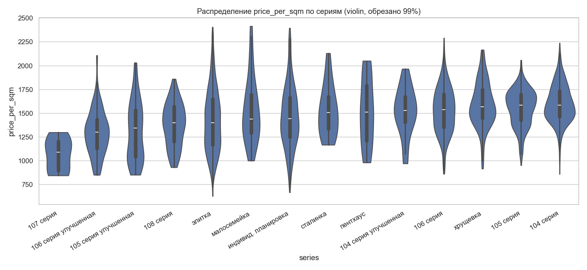

**Что видно.** Violin показывает не только медианы, но и форму распределения внутри серии. У «элитки» широкое распределение (внутри много разнокачественных ЖК), у «хрущёвки»/«104 серии» — узкое и плотное. Это значит: «элитка» сама по себе плохо предсказывает — нужно добавлять взаимодействие с `geo_cluster` или `condition`.

Полная таблица медиан/средних/std по всем категориям сохранена в `figs/ppsqm_summary.csv`.

---

## 6. Гео-группы

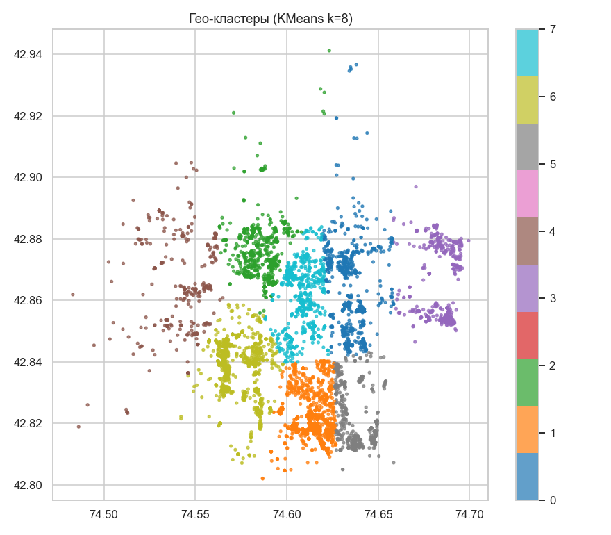

**Что видно.** KMeans с k=8 разбивает Бишкек на 8 геозон. Кластеры визуально соответствуют районам (центр, Джал, мкрн, Восток, окраины). Эти границы воспроизводимы и стабильны для линейной модели.

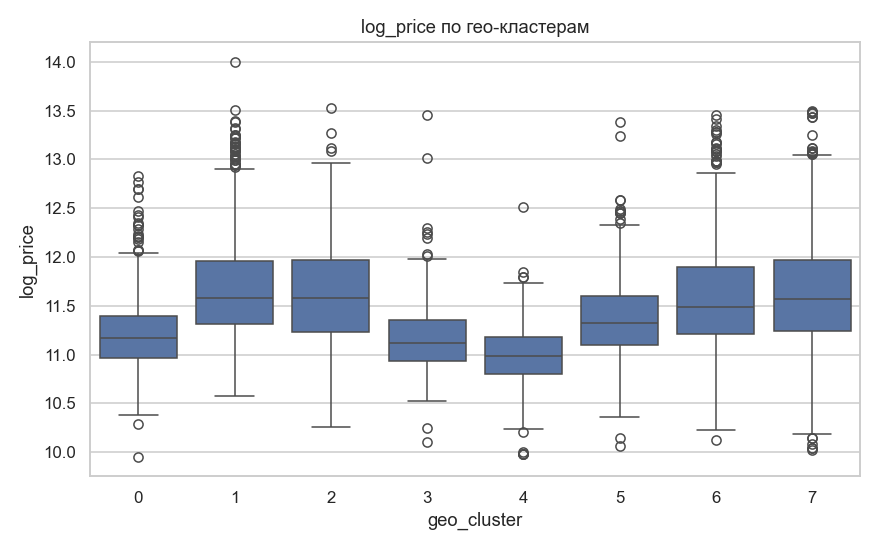

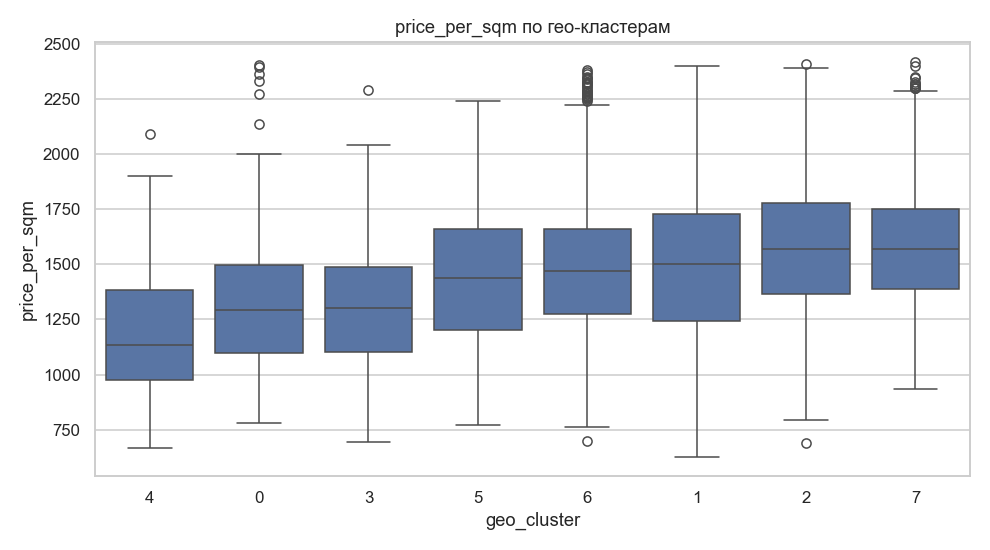

**Что видно.** Разброс медианной цены между кластерами ≈ **$47800**, медианной `price_per_sqm` — от **$1135** до **$1581** за м². Сырые `lat`/`lon` дают для линейной модели слабый сигнал (зависимость нелинейная), а one-hot по `geo_cluster` — сильный и интерпретируемый.

---

## 7. Мультиколлинеарность

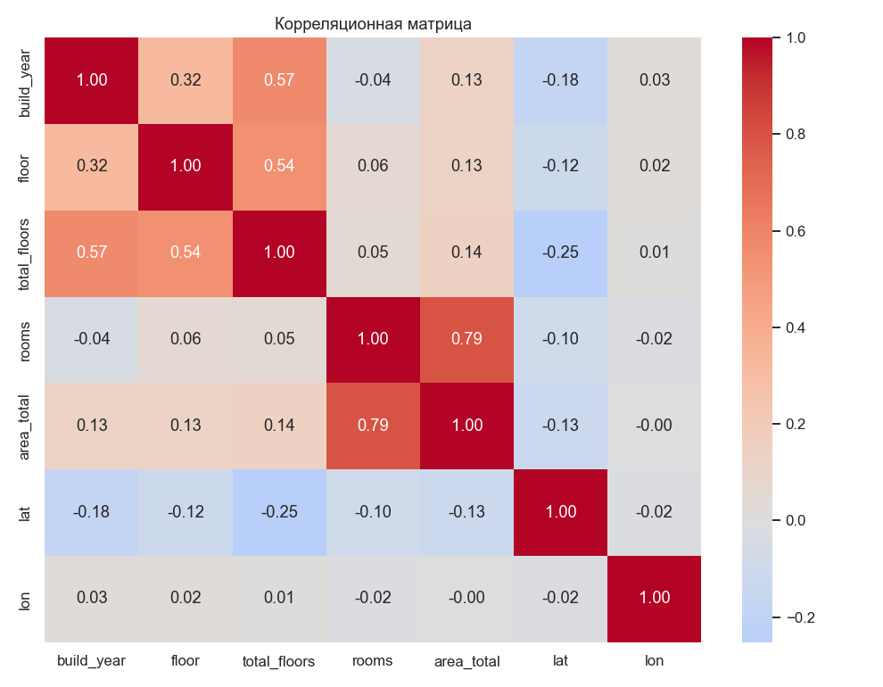

| Признак | VIF |
|---|---:|
| build_year | 1.57 |
| floor | 1.43 |
| total_floors | 1.96 |
| rooms | 2.84 |
| area_total | 2.88 |
| lat | 1.08 |
| lon | 1.0 |

**Что видно.** Сильная корреляция между `rooms` и `area_total` (r≈0.8): больше комнат = больше площадь. VIF > 5 — повод задуматься, > 10 — проблема: коэффициенты линейной модели становятся нестабильными. **Решение:** оставить только `area_total` (или `log(area_total)`), а вместо `rooms` подать `area_per_room = area_total / rooms` — это декоррелированный признак, показывающий «компактность планировки».

---

## 8. Бейзлайн OLS

Простейший OLS на голых числовых: `log_price ~ area_total + rooms + build_year + floor + total_floors + lat + lon`. Обучен на 5223 строках без NaN.

- **R² = 0.736**, adj R² = 0.736
- Skew остатков = -0.089, Shapiro p = 2.59e-27

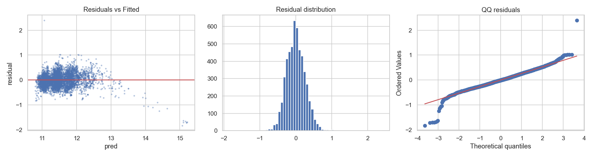

**Что видно.** Residuals vs Fitted — есть веер (гетероскедастичность ослабла по сравнению с сырым таргетом, но не пропала). QQ — тяжёлые хвосты, особенно слева (недооценка дешёвых объектов). Это хороший базовый ориентир: после добавления log(area), OHE категорий и geo_cluster R² должен подняться значительно.

---

## 9. Сводные рекомендации для линейной модели

### Обязательно
1. **Таргет**: `y = log1p(usd_price)`. Метрика — RMSE/MAE на лог-шкале (= RMSLE/MAPE на исходной).
2. **Площадь**: подавать `log(area_total)`, а не сырую.
3. **One-hot** для `series`, `condition`, `building_material`, `offer_type`. Объединить редкие категории `series` (count < 30) в `series_other`.
4. **Пропуски `condition`** (8%) → отдельная категория `unknown`, не выкидывать.
5. **Geo**: KMeans k=8 → one-hot `geo_cluster`. Сырые `lat`/`lon` либо убрать, либо оставить как остаточный сигнал.
6. **Фильтры данных**:
   - дропнуть строки с `area_living > area_total` (5 шт),
   - дропнуть строки с `lon` вне [70, 80] (перепутаны координаты),
   - клиппинг таргета по 1/99 перцентилю чтобы не учиться на выбросах.
7. **rooms=1000** → флаг `is_free_layout = 1`, само поле `rooms` заменить на NaN→медиану.
8. **build_year** → `building_age = 2026 - build_year`, флаг `is_offplan = build_year > 2026`.

### Сильно поможет
9. `floor_ratio = floor / total_floors`, `is_first_floor`, `is_last_floor` — нелинейный эффект этажа.
10. **Декорреляция**: не подавать `rooms` и `area_total` вместе — взять `area_per_room`.
11. **Регуляризация обязательна**: Ridge / ElasticNet — у нас десятки OHE-признаков и шум по редким категориям. Только Lasso сам отбросит малозначимые.
12. **Robust loss** (Huber) или таргет-клиппинг — на выбросах $1.2M линейка ломается.
13. **K-Fold CV с группировкой по `geo_cluster`** — иначе утечка географии в фолд завышает оценку.

### После обучения проверить
- Residuals vs fitted: веер → гетероскедастичность → WLS или Box-Cox таргета.
- Коэффициенты при OHE серий должны идти лесенкой (малосемейка < хрущёвка < ... < пентхаус); если порядок ломается — переобучение.
- Permutation importance: `log(area_total)`, `series`, `geo_cluster`, `condition` должны быть в топе.
