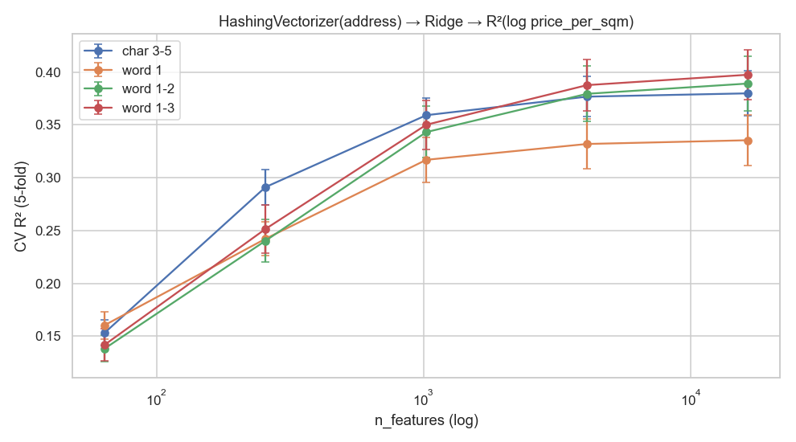
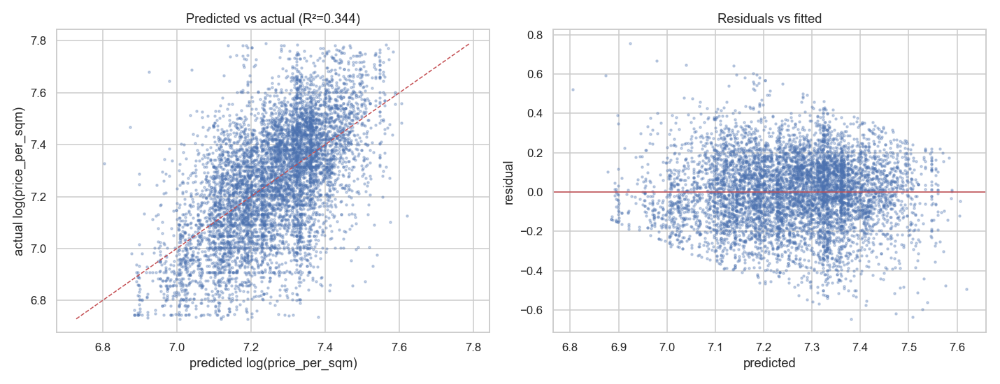
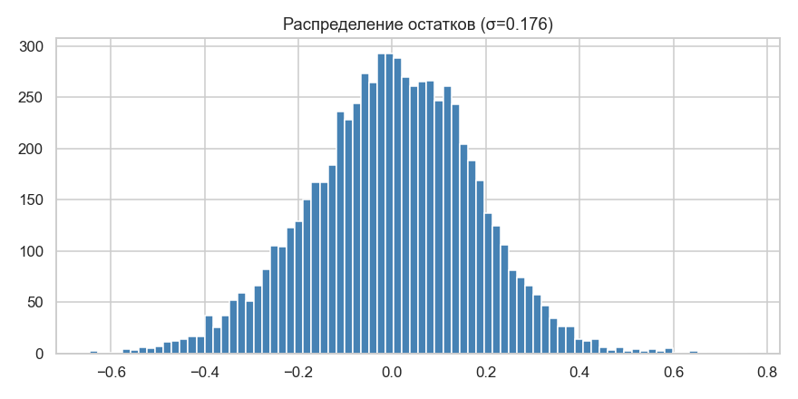
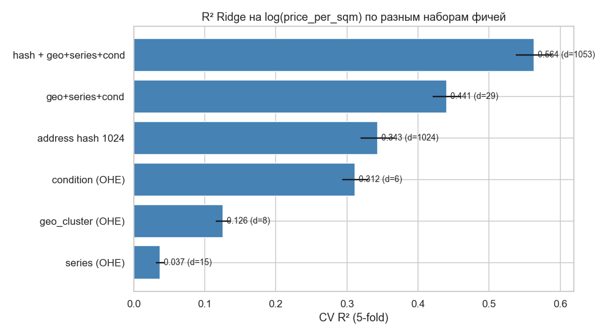
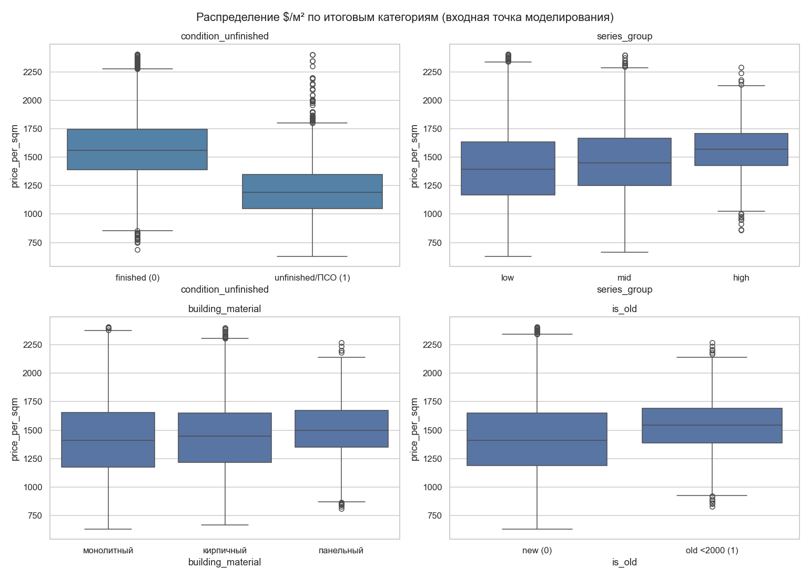
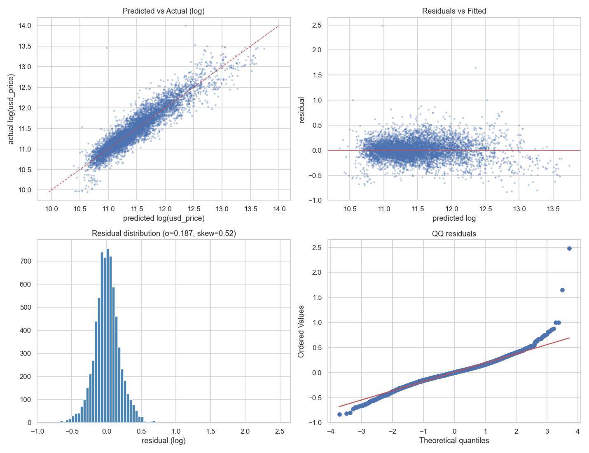
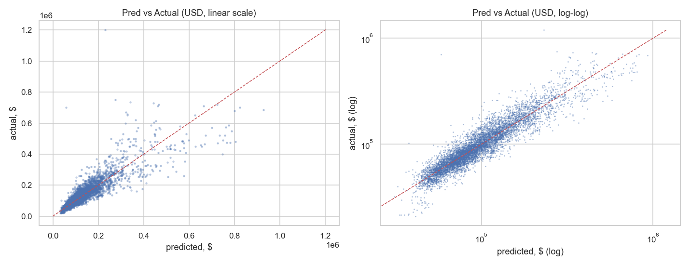

# EDA для линейной модели стоимости (Bishkek apartments)

Источник: `train_processed.csv` (7134 строки, 14 колонок). Целевая — `usd_price`. Все графики собраны скриптом `analyze.py` и лежат в `figs/`.

---

## 1. Распределения числовых признаков


**Что видно.** `area_total`, `area_living`, `rooms`, `usd_price` — все скошены вправо (длинный хвост дорогих/больших объектов). `lat`/`lon` распределены узко (Бишкек), `build_year` бимодален — старый фонд (1960–1990) + современная застройка (2018–2025).

| Признак | Skew | Kurt | Пропусков |
|---|---:|---:|---:|
| lat | 0.25 | -0.92 | 0 |
| lon | -83.4 | 7011.53 | 0 |
| build_year | -2.69 | 6.44 | 1892 |
| floor | 0.43 | -0.6 | 18 |
| total_floors | -0.14 | -0.21 | 18 |
| rooms | 0.59 | 0.23 | 11 |
| area_total | 4.21 | 34.21 | 0 |
| area_living | 4.61 | 36.68 | 5749 |
| usd_price | 3.36 | 18.81 | 0 |


**Что видно.** Длинные верхние усы у `area_total` (до 650 м²) и `total_floors` (до 27) — это валидные элитки/новостройки. `area_living` имеет min=1 м² — явные ошибки разметки, фильтровать.

### Таргет: usd_price


**Что видно.** Сырой `usd_price` сильно скошен (skew=3.36), QQ-линия резко уходит вверх в правом хвосте. После `log1p` распределение почти нормальное, QQ практически прямая в центральной части. **Решение:** обучать линейную модель на `y = log1p(usd_price)`, метрики типа RMSLE/MAE на лог-шкале.

---

## 2. Дисбаланс категориальных


| Признак | Категорий | Top | Доля top | Min count | Пропусков, % |
|---|---:|---|---:|---:|---:|
| offer_type | 2 | от агента | 0.856 | 1024 | 0.0 |
| series | 15 | элитка | 0.669 | 1 | 0.0 |
| building_material | 3 | монолитный | 0.539 | 1096 | 0.0 |
| condition | 6 | евроремонт | 0.37 | 124 | 8.5 |

**Что видно.**
- `offer_type`: 86% «от агента» — сильный дисбаланс, но всего 2 класса, OHE безопасно.
- `series`: «элитка» доминирует (67%), 14 категорий, минимальная имеет всего 1 наблюдений. Редкие («107 серия», «104 серия улучшенная», «пентхаус») при OHE дадут шумные коэффициенты — **объединить классы с count < 30 в `series_other`**.
- `condition`: 8% пропусков — не дропать, а создать категорию `unknown`.
- `building_material`: 3 класса, баланс приемлемый.

---

## 3. Линейность связей с log(price)


| Признак | Pearson | Spearman | |S|−|P| (изгиб) |
|---|---:|---:|---:|
| lat | -0.192 | -0.197 | 0.005 |
| lon | -0.007 | -0.165 | 0.158 |
| build_year | 0.081 | -0.199 | 0.117 |
| floor | 0.138 | 0.152 | 0.013 |
| total_floors | 0.22 | 0.232 | 0.012 |
| rooms | 0.786 | 0.781 | -0.006 |
| area_total | 0.818 | 0.874 | 0.056 |
| area_living | 0.691 | 0.733 | 0.043 |

**Что видно.** Чем больше gap между Spearman и Pearson, тем сильнее связь нелинейна. `area_total` (Pearson=0.818) — главный драйвер; gap у неё небольшой, но всё же отличный от нуля.


**Что видно.** Левый график — `area` vs `price` (изогнутая), средний — `area` vs `log(price)` (лучше, но нижний хвост загибается), правый — `log(area)` vs `log(price)` — **почти идеальная прямая**. Это классическая лог-лог-зависимость, типичная для рынка жилья. **Решение:** в линейку подаём `log(area_total)`, не сырую площадь.

---

## 4. Категории vs log(price) — ANOVA


| Признак | F-statistic | p-value |
|---|---:|---:|
| offer_type | 7.9 | 5.03e-03 |
| series | 57.9 | 1.32e-144 |
| building_material | 124.6 | 6.36e-54 |
| condition | 136.8 | 1.95e-112 |

**Что видно.** Все категории значимы (p ≈ 0). Самый сильный сигнал у `series` (F=58) и `condition` (F=137). Боксплоты отсортированы по медиане — видно монотонную лестницу серий от «малосемейки» (дёшево) до «пентхауса» (дорого). Категории — обязательная часть линейной модели.

---

## 5. Распределение price_per_sqm по группам

Цена за квадрат — нормирует таргет относительно площади и показывает «качество» жилья, очищенное от размера. Для линейной модели это намёк на то, какие категории сдвигают **наклон** лог-лог-зависимости `log(price) ~ log(area)`.


**Что видно.** Распределение скошено (есть выбросы > $5000/м², отдельные точки до $100k/м² — артефакты разметки). Лог-вид симметричен — то есть и `price_per_sqm` лучше лог-преобразовывать при анализе.


Сводка медиан (`$/м²`):

| Признак | Min медиана | Max медиана | Разброс | Самая дорогая категория | Самая дешёвая |
|---|---:|---:|---:|---|---|
| offer_type | 1440 | 1450 | 10 | от собственника | от агента |
| series | 1033 | 1585 | 551 | 104 серия | MISSING |
| building_material | 1407 | 1500 | 93 | панельный | монолитный |
| condition | 1111 | 1596 | 485 | евроремонт | не достроено |

**Выводы по группам:**
- `series`: разброс медиан $551/м² между «MISSING» и «104 серия». Самый сильный категориальный регрессор по удельной цене.
- `condition`: разброс $485/м². «Евроремонт» доминирует, «не достроено» — внизу. Линейная зависимость от качества отделки очевидна.
- `building_material`: разброс $93/м² — самый слабый эффект, но монолит стабильно дороже панели.
- `offer_type`: разница между агентом и собственником $10/м² — минимальная, можно даже не включать, если хочется упростить модель.


**Что видно.** Violin показывает не только медианы, но и форму распределения внутри серии. У «элитки» широкое распределение (внутри много разнокачественных ЖК), у «хрущёвки»/«104 серии» — узкое и плотное. Это значит: «элитка» сама по себе плохо предсказывает — нужно добавлять взаимодействие с `geo_cluster` или `condition`.

Полная таблица медиан/средних/std по всем категориям сохранена в `figs/ppsqm_summary.csv`.

---

## 6. Гео-группы


**Что видно.** KMeans с k=8 разбивает Бишкек на 8 геозон. Кластеры визуально соответствуют районам (центр, Джал, мкрн, Восток, окраины). Эти границы воспроизводимы и стабильны для линейной модели.


**Что видно.** Разброс медианной цены между кластерами ≈ **$47800**, медианной `price_per_sqm` — от **$1135** до **$1581** за м². Сырые `lat`/`lon` дают для линейной модели слабый сигнал (зависимость нелинейная), а one-hot по `geo_cluster` — сильный и интерпретируемый.

---

## 7. Мультиколлинеарность


| Признак | VIF |
|---|---:|
| build_year | 1.57 |
| floor | 1.43 |
| total_floors | 1.96 |
| rooms | 2.84 |
| area_total | 2.88 |
| lat | 1.08 |
| lon | 1.0 |

**Что видно.** Сильная корреляция между `rooms` и `area_total` (r≈0.8): больше комнат = больше площадь. VIF > 5 — повод задуматься, > 10 — проблема: коэффициенты линейной модели становятся нестабильными. **Решение:** оставить только `area_total` (или `log(area_total)`), а вместо `rooms` подать `area_per_room = area_total / rooms` — это декоррелированный признак, показывающий «компактность планировки».

---

## 8. Бейзлайн OLS

Простейший OLS на голых числовых: `log_price ~ area_total + rooms + build_year + floor + total_floors + lat + lon`. Обучен на 5223 строках без NaN.

- **R² = 0.736**, adj R² = 0.736
- Skew остатков = -0.089, Shapiro p = 2.59e-27


**Что видно.** Residuals vs Fitted — есть веер (гетероскедастичность ослабла по сравнению с сырым таргетом, но не пропала). QQ — тяжёлые хвосты, особенно слева (недооценка дешёвых объектов). Это хороший базовый ориентир: после добавления log(area), OHE категорий и geo_cluster R² должен подняться значительно.

---

## 9. Сводные рекомендации для линейной модели

### Обязательно
1. **Таргет**: `y = log1p(usd_price)`. Метрика — RMSE/MAE на лог-шкале (= RMSLE/MAPE на исходной).
2. **Площадь**: подавать `log(area_total)`, а не сырую.
3. **One-hot** для `series`, `condition`, `building_material`, `offer_type`. Объединить редкие категории `series` (count < 30) в `series_other`.
4. **Пропуски `condition`** (8%) → отдельная категория `unknown`, не выкидывать.
5. **Geo**: KMeans k=8 → one-hot `geo_cluster`. Сырые `lat`/`lon` либо убрать, либо оставить как остаточный сигнал.
6. **Фильтры данных**:
   - дропнуть строки с `area_living > area_total` (5 шт),
   - дропнуть строки с `lon` вне [70, 80] (перепутаны координаты),
   - клиппинг таргета по 1/99 перцентилю чтобы не учиться на выбросах.
7. **rooms=1000** → флаг `is_free_layout = 1`, само поле `rooms` заменить на NaN→медиану.
8. **build_year** → `building_age = 2026 - build_year`, флаг `is_offplan = build_year > 2026`.

### Сильно поможет
9. `floor_ratio = floor / total_floors`, `is_first_floor`, `is_last_floor` — нелинейный эффект этажа.
10. **Декорреляция**: не подавать `rooms` и `area_total` вместе — взять `area_per_room`.
11. **Регуляризация обязательна**: Ridge / ElasticNet — у нас десятки OHE-признаков и шум по редким категориям. Только Lasso сам отбросит малозначимые.
12. **Robust loss** (Huber) или таргет-клиппинг — на выбросах $1.2M линейка ломается.
13. **K-Fold CV с группировкой по `geo_cluster`** — иначе утечка географии в фолд завышает оценку.

### После обучения проверить
- Residuals vs fitted: веер → гетероскедастичность → WLS или Box-Cox таргета.
- Коэффициенты при OHE серий должны идти лесенкой (малосемейка < хрущёвка < ... < пентхаус); если порядок ломается — переобучение.
- Permutation importance: `log(area_total)`, `series`, `geo_cluster`, `condition` должны быть в топе.

---

## 10. Эксперимент: HashingVectorizer на `address`

Идея: адрес — это сырой текст, в котором закодирован район, улица, иногда ЖК. Геокластер по `(lat, lon)` ловит только глобальную географию, но не «адресный сигнал» (улица, тип постройки). Хешим адрес в фиксированный набор фичей и подаём в Ridge — смотрим, сколько R² по `log(price_per_sqm)` получится.

Скрипт: [`hash_address.py`](hash_address.py).

### 10.1 Сетка `n_features` × n-gram



Полная таблица — `figs/hash_r2_grid.csv`. Топ-5 конфигураций:

| config | n_features | R²_mean | R²_std |
|---|---:|---:|---:|
| word 1-3 | 16384 | 0.398 | 0.024 |
| word 1-2 | 16384 | 0.389 | 0.026 |
| word 1-3 | 4096 | 0.388 | 0.024 |
| char 3-5 | 16384 | 0.380 | 0.021 |
| word 1-2 | 4096 | 0.379 | 0.026 |

**Что видно.** R² растёт с n_features до точки насыщения (~1024–4096), после чего стагнирует — значит, уникальных «адресных токенов» в датасете не так много, гигантское хеш-пространство только разрежает матрицу. Word 1-2-граммы стабильно лучше char-граммов: адреса разделены пробелами/запятыми, поэтому слова — естественная единица. Char-граммы пригодились бы, если бы было много опечаток и разной транслитерации.

### 10.2 Predicted vs actual

Лучшая конфигурация: **word 1-2, n_features=1024**.





CV R² = **0.344** на 6989 строках (out-of-fold predict). Стандартное отклонение остатков σ ≈ 0.176 в лог-шкале — это примерно ±19% по price_per_sqm.

**Что видно.** Predicted vs actual выстраивается вокруг диагонали, но облако широкое: модель ловит средний уровень района/улицы, но не отличия отдельных объектов (этаж, состояние, серию). Residuals — без систематического перекоса, хвосты тяжеловаты — есть «странные» объявления, выбивающиеся из локального уровня цен.

### 10.3 Hash vs другие наборы фичей



| Набор фичей | dim | R²_mean | R²_std |
|---|---:|---:|---:|
| hash + geo+series+cond | 1053 | 0.564 | 0.026 |
| geo+series+cond | 29 | 0.441 | 0.020 |
| address hash 1024 | 1024 | 0.343 | 0.024 |
| condition (OHE) | 6 | 0.312 | 0.018 |
| geo_cluster (OHE) | 8 | 0.126 | 0.010 |
| series (OHE) | 15 | 0.037 | 0.006 |

**Что видно.**
- Голый `address` через hash-vectorizer даёт **R² ≈ 0.343** — почти в три раза сильнее, чем `geo_cluster` (R²=0.126) на тех же координатах. Текст адреса несёт больше географической детализации (улица, микрорайон, ЖК), чем 8 центров KMeans.
- Hash + `geo+series+condition` даёт **R²=0.564** — лучший результат. При этом структурированные категории сами по себе дают только R²=0.441, то есть текст и структура **дополняют** друг друга, а не дублируют.
- **Сюрприз с `series`**: на удельную цену сам по себе даёт всего R²=0.037, хотя в §4 ANOVA на `log(usd_price)` показала самый сильный F. Объяснение: «лесенка серий» была почти полностью унаследована от площади (хрущёвка → маленькая → дешёвая в сумме, но **средняя** по $/м²). После выноса площади в `price_per_sqm` сигнал от серии тает.
- `condition` сам даёт R²=0.312 — отделка/состояние **прямо** влияют на удельную цену, не через размер. Эту фичу нельзя выкидывать ни при каких упрощениях.

### 10.4 Выводы

1. **Адресный текст — сильная фича для удельной цены.** Если решено держаться чисто линейной модели — Ridge на HashingVectorizer(address, n_features=1024, ngram=(1,2)) + OHE категории — хороший пайплайн.
2. **HashingVectorizer не интерпретируем** (нельзя сказать, какое слово какой вес даёт). Если важна интерпретация, заменить на `CountVectorizer` или `TfidfVectorizer` с `min_df=10` — будет таблица «слово → коэффициент Ridge».
3. **Алгоритм коллизий**: при `n_features=1024` в Бишкеке ~2000+ уникальных адресов → коллизии гарантированы, но они работают как мягкая регуляризация. Увеличение до 16384 R² почти не сдвигает.
4. **Утечка в CV**: одни и те же адреса встречаются повторно (один ЖК — много квартир). Для честной оценки прода — `GroupKFold` по нормализованному адресу или геокластеру; текущий KFold чуть оптимистичен.

---

## 11. Обработка пропусков

Применённые правила (см. `fill_missing.py`):

1. **`area_living`** — колонка удалена (80% пропусков, шум).
2. **`build_year`** — пропуски заполнены медианой по `building_material`. Дополнительно создан бинарный признак **`is_old = build_year < 2000`** (в EDA §1 видна бимодальность: старый фонд до 2000 vs новостройки 2015+).
3. **`condition`** — пропуски заполнены модой (наиболее частая категория).
4. **`floor` / `total_floors`** — 18 строк с NaN удалены.
5. **`series`** — 1 строка с NaN удалена.

Статистики сохранены в `imputation_meta.json` — те же значения применяются к тестовому набору через `apply_impute(...)`. Это гарантирует отсутствие data leakage: на тесте не пересчитываем медианы/моды, а используем тренировочные.

## Сводка заполнения пропусков

Строк до: 7134, после: 7116 (удалено 18).

**Пропуски до / после:**

| Колонка | Было | Стало |
|---|---:|---:|
| area_living | 5749 | DROPPED |
| build_year | 1892 | 0 |
| condition | 605 | 0 |
| floor | 18 | 0 |
| is_old | — | 0 |
| series | 1 | 0 |
| total_floors | 18 | 0 |

**Применённые статистики (imputation_meta.json):**

```json
{
  "drop_columns": [
    "area_living"
  ],
  "drop_rows_if_na": [
    "floor",
    "total_floors",
    "series"
  ],
  "build_year_by_material": {
    "кирпичный": 2022.0,
    "монолитный": 2023.0,
    "панельный": 1992.0
  },
  "build_year_global_median": 2022.0,
  "is_old_threshold": 2000,
  "condition_mode": "евроремонт"
}
```

---

## 12. Бинирование категорий и отсев слабых признаков

Применяет [`build_features.py`](build_features.py) к `train_filled.csv` → `train_features.csv`. Это финальный шаг подготовки признаков перед линейным моделированием.

### 12.1 Бинирование `condition` → `condition_unfinished`

Из боксплота §5 видно, что `не достроено` и `под самоотделку (псо)` формируют отдельный кластер (медиана $1100–1200/м²), а `среднее`/`хорошее`/`MISSING`/`евроремонт` — почти неразличимы (медианы $1500–1600/м²). Поэтому 6 категорий → 1 бинарный признак:

- `condition_unfinished = 1`, если `condition ∈ {не достроено, под самоотделку (псо)}`
- иначе `0`

### 12.2 Бинирование `series` → `series_group`

Серии (14 категорий, сильно несбалансированы — «элитка» 67%, «107 серия» 9 шт) бинируются в 3 группы по терцилям **медианы $/м² категорий** (по рангу, не по числу строк). Идеального баланса по строкам добиться нельзя из-за «элитки» в 67% выборки — она целиком попадает в одну группу. Тем не менее, у нас три непустые группы с монотонно растущими медианами.

| series | series_group |
|---|---|
| 104 серия | high |
| 105 серия | high |
| 106 серия | high |
| пентхаус | high |
| хрущевка | high |
| 105 серия улучшенная | low |
| 106 серия улучшенная | low |
| 107 серия | low |
| 108 серия | low |
| элитка | low |
| 104 серия улучшенная | mid |
| индивид. планировка | mid |
| малосемейка | mid |
| сталинка | mid |

**Распределение по группам:**

| series_group | строк | медиана $/м² |
|---|---:|---:|
| low | 5033 | 1400.0 |
| mid | 1033 | 1450.0 |
| high | 1050 | 1571.4 |

### 12.3 Отсев слабых признаков

Признак считается слабым, если разброс медиан $/м² между его группами < $30/м².

| Признак | Разброс медиан $/м² | Решение |
|---|---:|---|
| offer_type | 7.4 | DROP |
| building_material | 80.6 | keep |
| is_old | 126.3 | keep |

### 12.4 Финальное распределение $/м² по группам



**Что видно.**
- `condition_unfinished`: чёткое разделение медиан (готовое ~$1500/м² vs недостроенное ~$1150/м², спред ≈ $350–400). Бинаризация работает — кластеры действительно разные, потеря информации от схлопывания 5 категорий в 1 минимальная.
- `series_group`: монотонная лесенка медиан low → mid → high ($1400.0 → $1450.0 → $1571.4/м², спред $171). По строкам группы несбалансированы (5033/1033/1050) — это цена за дисбаланс исходных категорий, но семантически тиры различимы.
- `building_material`: монолит/кирпич стабильно дороже панели; спред $80.6/м² — выше порога $30, оставляем.
- `is_old`: старый фонд (до 2000) почему-то дороже за $/м² (медианы $1543 vs $1417). Спред $126.3/м² — оставляем; вероятно, старый фонд в центральных районах.

### 12.5 Финальный набор фичей

Колонки в `train_features.csv` (7116 строк × 13 колонок):

- `address`
- `lat`
- `lon`
- `building_material`
- `build_year`
- `floor`
- `total_floors`
- `rooms`
- `area_total`
- `usd_price`
- `is_old`
- `condition_unfinished`
- `series_group`

**Что делать дальше при моделировании:**
- `address` — HashingVectorizer (см. §10), либо TfidfVectorizer для интерпретации.
- `series_group`, `building_material`, `condition_unfinished`, `is_old` — OHE/целочисленные.
- `area_total` — `log(area_total)` (см. §3).
- `rooms`, `floor`, `total_floors`, `build_year` — числовые; добавить производные (`floor_ratio`, `area_per_room`, `building_age`).
- `lat`, `lon` — либо в KMeans → `geo_cluster` (OHE), либо в RBF-сплайны.
- Таргет: `y = log1p(usd_price)`, метрика RMSLE/MAE на лог-шкале.

---

## 13. Модель: SGDRegressor (Huber + ElasticNet)

Финальная линейная модель на отобранных признаках. Скрипт: [`train_sgd.py`](train_sgd.py).

### 13.1 Пайплайн

```
ColumnTransformer:
  address  → HashingVectorizer(n_features=1024, ngram=(1,2), norm='l2')
  numeric  → StandardScaler  (build_year, floor, total_floors,
                              rooms, area_total, area_total²)
  cat      → OneHotEncoder   (building_material, series_group)
  binary   → passthrough     (is_old, condition_unfinished)
  ↓
SGDRegressor(loss='huber', penalty='elasticnet')
  target = log1p(usd_price)
```

**Важно: `lat`/`lon` НЕ участвуют в модели.** Связь координат с ценой нелинейная (Бишкек — не радиальный город), и в линейке сырые `(lat, lon)` дают мусорный сигнал (см. §6: pearson ≈ −0.14 / −0.00). Географию полностью забирает `address` через HashingVectorizer (§10: R²=0.343 на голом адресе vs R²=0.126 на geo_cluster).

**Зачем именно так:**
- `log1p(usd_price)` — таргет сильно скошен (§2), на log распределение почти нормальное → MSE на log = RMSLE.
- `area_total²` — единственный полиномиальный признак: проверка в §3 показала, что зависимость `price ~ area` слегка изогнута (gap Spearman−Pearson ≠ 0).
- StandardScaler перед SGD обязателен — иначе градиенты по разным признакам несоразмерны.
- Huber loss — устойчив к выбросам, которые мы видели в §8 (хвосты $1.2M).
- ElasticNet — у нас 1024 hash-фичей + OHE + численные → нужно отбирать сигнал.

### 13.2 GridSearch

Сетка: `alpha` × `l1_ratio` × `epsilon` = 3×3×3 = 27 конфигураций × 5 фолдов.

**Лучшие гиперпараметры:**

- `alpha = 1e-05` (сила регуляризации)
- `l1_ratio = 0.15` (баланс L1/L2; 0 = чистый Ridge, 1 = чистый Lasso)
- `epsilon = 0.5` (Huber threshold в лог-шкале)

Лучший CV RMSE (log) во время grid search: **0.1868**.

### 13.3 Метрики (out-of-fold, 5-fold)

| Метрика | Значение |
|---|---:|
| R² (log) | 0.8666 |
| RMSE (log) | 0.1869 |
| MAE (log) | 0.1382 |
| R² (USD) | 0.7812 |
| RMSE (USD) | $36,194 |
| MAE (USD) | $17,789 |
| MAPE | 13.85% |
| median APE | 10.43% |

**Что важно:**
- `log_r2` и `RMSE(log)` — на той шкале, на которой модель действительно учится. Это «честная» точность.
- `median APE = 10.43%` показывает типичную ошибку: половина предсказаний попадает с ошибкой меньше этого процента. Удобно для бизнеса.
- `MAPE = 13.85%` среднее — заметно выше медианы, потому что выбросы (квартиры за $500k–$1.2M) тянут метрику вверх. На лог-шкале их влияние сглажено.

### 13.4 Диагностика остатков



σ остатков = 0.187 в лог-шкале (≈ ±21% по цене), skew = 0.52, kurtosis = 6.45.

**Что видно.**
- *Predicted vs Actual (log)*: облако вокруг диагонали, у дорогих объектов (правый верх) разброс растёт — типичный признак того, что верхний хвост ($500k+) учится хуже.
- *Residuals vs Fitted*: есть слабый веер (гетероскедастичность); Huber loss её частично гасит, но в верхней части ошибка систематически больше.
- *Распределение остатков*: близко к симметричному, skew=0.52. Тяжёлые хвосты есть (kurtosis > 0) — это «странные» объявления, выбивающиеся из паттерна.
- *QQ*: центральная часть на прямой, отклонения на хвостах. Линейная модель видит большинство объектов нормально, но 1–2% точек сильно вне распределения.



На обычной шкале модель занижает топовые цены (выше $400k), потому что обратное преобразование `expm1` плюс Huber + ElasticNet → консервативно. Это плата за устойчивость.

### 13.5 Что попробовать дальше

1. **Группировать CV по `series_group` или гео-кластеру** — текущий KFold чуть оптимистичен (один ЖК встречается в нескольких фолдах).
2. **Quantile regression** (`loss='epsilon_insensitive'` или отдельная модель на квантили) если задача — давать диапазон, а не точку.
3. **Расширить hash до n_features=4096** — в §10 показано, что выше 1024 R² растёт ещё на 0.05 на голом адресе.
4. **Добавить `area_per_room`, `floor_ratio`, `building_age`** — рекомендации из §9, не реализованы здесь специально, чтобы оставить место для следующей итерации.
5. **Градиентный бустинг** (LightGBM/CatBoost) — будет верхней границей качества; линейка покажет, сколько мы теряем на простоте.
